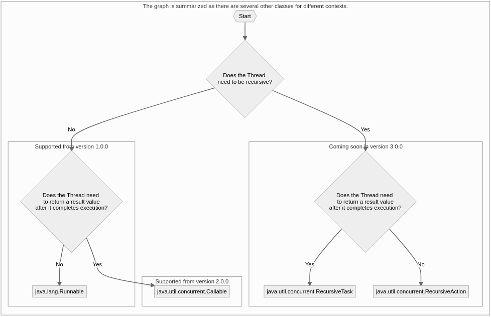
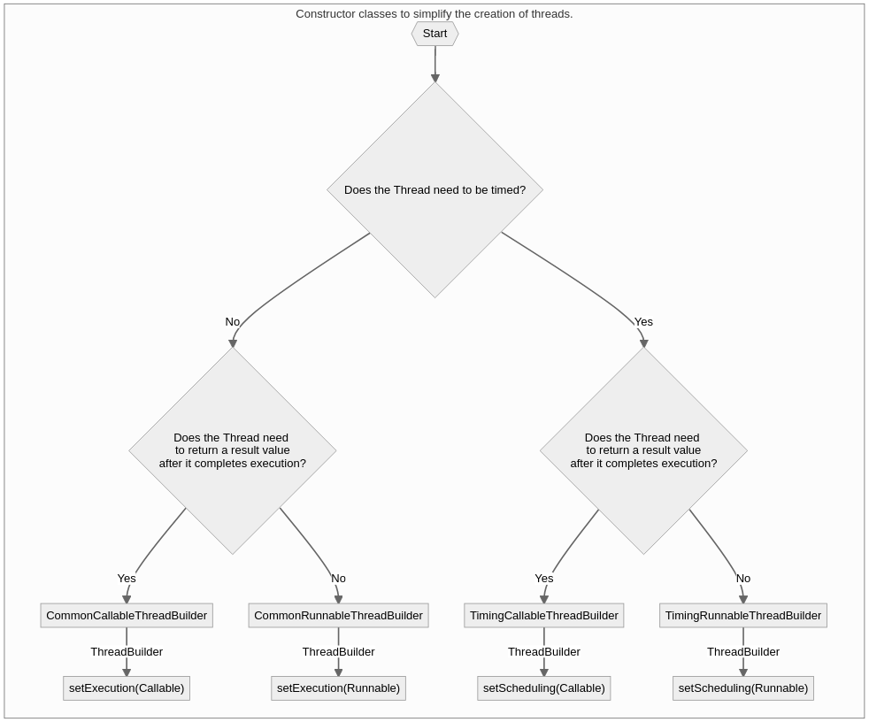

# Commons-thread [:rewind:](https://github.com/armange/j-commons)

[](https://github.com/armange/j-commons/actions/workflows/gradle.yml)

This release was created based on the need to simplify daily software development tasks. It contains a framework that simplifies thread creation for some specific scenarios that may be routine for some types of software projects.

- [Some context](#somecontext)

<a name="summary"></a>

##### The tasks simplified by this lib are:
- [Thread delayed](#delay).
- [Thread timed out](#timeout).
- [Thread loop](#interval).
- [Exception handling](#uncaughtexception).
- [Trigger](#afterexecution).
- [Naming](#naming).
- [Prioritization](#prioritization).
- [No Schedule](#noschedule).
- [Thread Pool](#threadpool).
- [Consumer of the thread's resulting value](#threadconsumer)
- [Get the resulting value from the thread](#getthreadval)
- [The combination of several of these factors together](#allfeatures)

##### Docs
 - [Javadoc](https://armange.github.io/j-commons/commons-thread/2-0-0/javadoc)
 - [Tests report](https://armange.github.io/j-commons/commons-thread/2-0-0/test)
 - [Jacoco](https://armange.github.io/j-commons/commons-thread/2-0-0/jacoco)

[![Build][buildbadge]](https://github.com/armange/j-commons/commits/master) 
[![Nexus][nexusbadge]](https://search.maven.org/artifact/br.com.armange/commons-thread) 
[![Coverage][coveragebadge]](https://sonarcloud.io/dashboard?id=armange_j-commons-commons-thread) 
[![Quality][qualitybadge]](https://sonarcloud.io/dashboard?id=armange_j-commons-commons-thread) 
[![License][licensebadge]](https://github.com/armange/j-commons/blob/development/LICENSE)

[buildbadge]: https://img.shields.io/github/workflow/status/armange/j-commons/Java%20CI?style=for-the-badge "Build Status"
[nexusbadge]: https://img.shields.io/nexus/r/br.com.armange/commons-thread?server=https%3A%2F%2Foss.sonatype.org&style=for-the-badge 
[coveragebadge]: https://img.shields.io/sonar/coverage/armange_j-commons-commons-thread?server=https%3A%2F%2Fsonarcloud.io&style=for-the-badge 
[qualitybadge]: https://img.shields.io/sonar/quality_gate/armange_j-commons-commons-thread?server=https%3A%2F%2Fsonarcloud.io&style=for-the-badge
[licensebadge]: https://img.shields.io/github/license/armange/j-commons?style=for-the-badge

##### Available package repository

 - [Central Repository](https://search.maven.org/artifact/br.com.armange/commons-thread)

##### [Maven import](https://search.maven.org/artifact/br.com.armange/commons-thread)

```xml
<dependency>
    <groupId>br.com.armange</groupId>
    <artifactId>commons-thread</artifactId>
    <version>2.0.0</version>
</dependency>
```

##### [Gradle import](https://search.maven.org/artifact/br.com.armange/commons-thread)

```
compile group: 'br.com.armange', name: 'commons-thread', version: '2.0.0'
```

<a name="somecontext"></a>

### Some context... [:arrow_double_up:](#summary)

To create a new thread, we need to observe the context in which it should be applied. For example, if it is necessary to return a value resulting from the termination of the thread, we would use a specific implementation, and for cases where the thread would not have any resulting value, we would use a different implementation. See a summarized example in the graphic below:

| Java classes for thread creation.                                         |
|-----------------------------------------------|
|  |

Following the same reasoning exemplified above, the thread constructors, provided by this lib, were also divided according to the context in which the thread will need to be applied, where threads that must return some value after their completion, will have a thread constructor different from the context where no resulting value would be expected from the thread. See a summarized example in the graphic below:

| Constructor classes to simplify the creation of threads.           |
|--------------------------------------------------------------------|
|  |

### Samples

<a name="delay"></a>

#### Delay [:arrow_double_up:](#summary)
```java
    ThreadBuilder
        .newBuilder()
        .setDelay(2000)
        .setExecution(() -> System.out.println("An execution with delay"))
        .start();
```

<a name="timeout"></a>

#### Timeout [:arrow_double_up:](#summary)
```java
    ThreadBuilder
        .newBuilder()
        .setTimeout(3000)
        .setExecution(() -> System.out.println("An execution with timeout"))
        .start();
```

<a name="interval"></a>

#### Interval(Thread loop) [:arrow_double_up:](#summary)
```java
    ThreadBuilder
        .newBuilder()
        .setInterval(1000)
        .setExecution(() -> System.out.println("An execution with interval"))
        .start();
```

<a name="uncaughtexception"></a>

#### Uncaught exception(Exception handling) [:arrow_double_up:](#summary)
```java
    ThreadBuilder
        .newBuilder()
        .setUncaughtExceptionConsumer(throwable -> {throw new RuntimeException(throwable);})
        .setExecution(() -> System.out.println("An execution with uncaught exception"))
        .start();
```

<a name="afterexecution"></a>

#### After execution consumer(trigger) [:arrow_double_up:](#summary)
```java
    ThreadBuilder
        .newBuilder()
        .setExecution(() -> System.out.println("An execution with an after-execution consumer"))
        .setAfterExecuteConsumer((runnable, throwable) -> System.out.println("The thread has already been finished"))
        .start()
```

<a name="naming"></a>

#### Naming [:arrow_double_up:](#summary)
```java
    ThreadBuilder
        .newBuilder()
        .setThreadNameSupplier(() -> "Thread name")
        .setExecution(() -> System.out.println("An execution with name"))
        .start();
```

<a name="prioritization"></a>

#### Prioritization [:arrow_double_up:](#summary)
```java
    ThreadBuilder
        .newBuilder()
        .setThreadPrioritySupplier(() -> 4)
        .setUncaughtExceptionConsumer(throwable -> {throw new RuntimeException(throwable);})
        .setExecution(() -> System.out.println("An execution with priority"))
        .start();
```

<a name="noschedule"></a>

#### No schedule [:arrow_double_up:](#summary)
```java
    ThreadBuilder
        .newBuilder()
        .setExecution(() -> System.out.println("An execution with priority"))
        .start();
```

<a name="threadpool"></a>

#### Thread pool [:arrow_double_up:](#summary)
```java
    ThreadBuilder
        .newBuilder(5)
        .setExecution(() -> System.out.println("Thread 1"))
        .startAndBuildOther()
        .setExecution(() -> System.out.println("Thread 2"))
        .startAndBuildOther()
        .setExecution(() -> System.out.println("Thread 3"))
        .startAndBuildOther()
        .setExecution(() -> System.out.println("Thread 4"))
        .startAndBuildOther()
        .setExecution(() -> System.out.println("Thread 5"))
        .start();
```
<a name="threadconsumer"></a>

#### Consumer of the thread's resulting value [:arrow_double_up:](#summary)
```java
    ThreadBuilder
        .newBuilder()
        .setExecution(() -> "An execution with priority")
        .setThreadResultConsumer(System.out::println)
        .start();
```

<a name="getthreadval"></a>

#### Get the resulting value from the thread [:arrow_double_up:](#summary)
```java
    final ExecutorResult<String> executorResult = ThreadBuilder
        .newBuilder()
        .setExecution(() -> "An execution with priority")
        .start();

    final Future<String> stringFuture = executorResult.getFutures().get(0);
    final String result = stringFuture.get();
```

<a name="allfeatures"></a>

#### The combination of several of these factors together [:arrow_double_up:](#summary)
```java
    ThreadBuilder
        .newBuilder(2)
        .setDelay(1000)
        .setTimeout(5000)
        .setInterval(1000)
        .setUncaughtExceptionConsumer(throwable -> {throw new RuntimeException(throwable);})
        .setAfterExecuteConsumer((runnable, throwable) -> System.out.println("The thread has already been finished"))
        .setThreadNameSupplier(() -> "Thread name")
        .setThreadPrioritySupplier(() -> 4)
        .setExecution(() -> System.out.println("All features"))
        .startAndBuildOther()
        .start();
```
